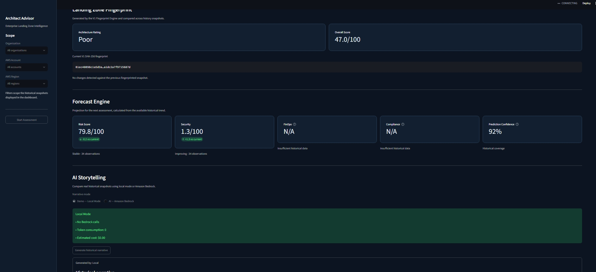
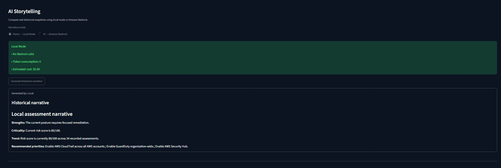
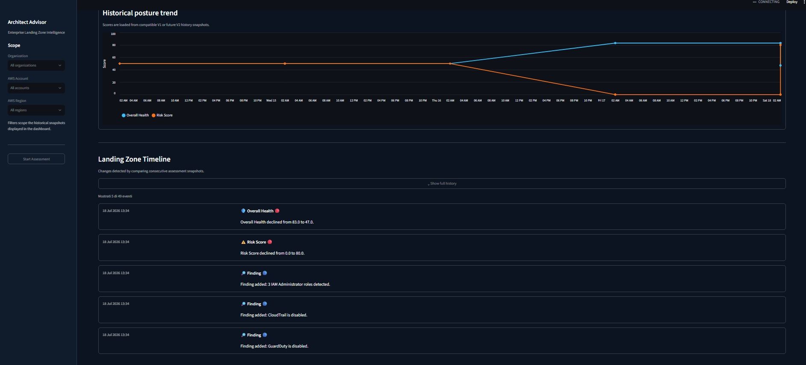
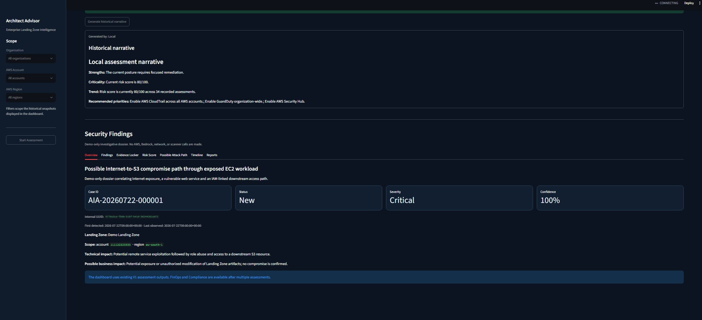

# 🏗️ AI Architect Advisor (AIA)


> **An Open-Source AI-powered Decision Intelligence Platform for AWS Landing Zones**

AI Architect Advisor (AIA) is an intelligent decision-support platform designed to help Cloud Architects understand, analyze, and improve complex AWS Landing Zones.

Instead of simply displaying AWS findings, AIA correlates cloud telemetry from multiple AWS services, calculates architectural risk, prioritizes remediation actions, predicts future posture, and generates AI-powered executive recommendations.

The platform combines traditional cloud assessment techniques with Artificial Intelligence to transform raw infrastructure data into actionable architectural intelligence.

---

## ✨ Key Features

- 🔍 Multi-service AWS analysis
- 📊 Enterprise Streamlit Dashboard
- 📈 Historical posture tracking
- 🔮 Forecast Engine
- 🤖 AI Storytelling (Local & Amazon Bedrock)
- 🛡️ Security Findings Investigation
- 📅 Landing Zone Timeline
- 🎯 Risk Prioritization Engine
- 🧠 Infrastructure Fingerprinting
- 📄 Executive Report Generation

---

# 🏛️ High-Level Architecture


**Figure 1.** High-level architecture of AI Architect Advisor.

The platform continuously analyzes AWS Landing Zone telemetry, processes cloud events through multiple AI decision engines, and produces actionable recommendations for Cloud Architects.

The architecture is composed of four major layers:

- **User Interface** – Enterprise Streamlit Dashboard
- **AI Advisor Engines** – Collection, Analysis, Risk, Prioritization, Decision and History
- **AWS Environment** – Organizations, IAM, CloudTrail, GuardDuty, Security Hub and additional AWS services
- **AI Services** – Amazon Bedrock for executive-level narratives and recommendations
- ## 🖥️ Dashboard Overview

The Enterprise Dashboard provides Cloud Architects with a centralized view of AWS Landing Zone health, historical posture, risk distribution, compliance metrics, and executive KPIs.

It allows engineers to quickly understand the current architectural status before investigating individual findings.


---

## 🔮 Forecast Engine

The Forecast Engine predicts the expected evolution of the AWS Landing Zone by analyzing historical assessment snapshots.

It estimates future Risk Score, Security Score, Compliance trends, FinOps readiness, and prediction confidence, enabling proactive decision making instead of reactive operations.



---

## 🤖 AI Storytelling

AI Storytelling converts historical assessment data into executive-level narratives.

The engine supports both:

- Local AI mode (offline demonstration)
- Amazon Bedrock integration

Instead of presenting raw metrics, the platform explains posture evolution, architectural changes, and recommended remediation priorities in natural language.



---

## 📅 Landing Zone Timeline

The Landing Zone Timeline provides a chronological history of infrastructure changes and assessment results.

Each event captures architectural modifications, posture variations, detected findings, and risk evolution, allowing Cloud Architects to understand how an AWS environment changes over time.



---

## 🛡️ Security Findings

The Security Findings module correlates evidence collected from AWS security services into a structured investigation report.

Each finding includes:

- Executive summary
- Technical impact
- Business impact
- Severity classification
- Confidence score
- Timeline
- Supporting evidence

The objective is to transform raw security alerts into actionable architectural intelligence.



---

---

# 🚀 Dashboard Showcase

Version 2 introduces a completely redesigned enterprise dashboard focused on historical analysis, executive visibility, forecasting, AI-assisted decision making and security investigations.
# ⚙️ AI Decision Pipeline

AI Architect Advisor follows a modular decision pipeline designed to transform raw AWS telemetry into actionable architectural recommendations.

```text
AWS Landing Zone
        │
        ▼
Collectors
        │
        ▼
Analyzers
        │
        ▼
Risk Engine
        │
        ▼
Priority Engine
        │
        ▼
Recommendation Engine
        │
        ▼
Executive Report Engine
        │
        ▼
AI Storytelling (Local / Amazon Bedrock)
        │
        ▼
Enterprise Dashboard
```

Each stage has a dedicated responsibility, making the platform modular, extensible, and easy to evolve.

---

# ☁️ Supported AWS Services

Current integrations include:

- AWS Organizations
- AWS IAM
- Amazon CloudTrail
- Amazon GuardDuty
- AWS Security Hub
- Amazon Bedrock

The architecture has been designed to support future integrations with additional AWS services such as AWS Config, Inspector, Access Analyzer, Macie, Detective, and Cost Explorer.

---

# 📂 Project Structure

```text
architect-intelligence-advisor/
│
├── dashboard_v2/
│   ├── app.py
│   ├── components/
│   └── modules/
│
├── docs/
│   ├── architecture.png
│   └── images/
│
├── history/
│
├── src/
│   ├── analyzers/
│   ├── collectors/
│   ├── config/
│   ├── engines/
│   ├── models/
│   ├── services/
│   └── utils/
│
├── tests/
├── README.md
├── LICENSE
└── requirements.txt
```

---

# 🚀 Installation

Clone the repository:

```bash
git clone https://github.com/michele-cloud-cyber/architect-intelligence-advisor.git

cd architect-intelligence-advisor
```

Install the required dependencies:

```bash
pip install -r requirements.txt
```

---

# ▶️ Running the Application

### Launch the Enterprise Dashboard

```bash
streamlit run dashboard_v2/app.py
```

The V2 dashboard is the primary user interface for AI Architect Advisor.

The original V1 assessment engine remains responsible for:

- Data collection
- AWS analysis
- Risk evaluation
- Historical snapshots
- AI Storytelling
- Recommendation generation

while Version 2 provides the enterprise visualization layer with historical analytics, forecasting, and security investigation capabilities.
# 🚧 Current Status

AI Architect Advisor is under active development.

The project has evolved from a proof-of-concept into an enterprise-oriented Decision Intelligence Platform for AWS Landing Zones.

Current development focuses on:

- Historical assessment analysis
- AI-assisted decision support
- Forecasting capabilities
- Executive reporting
- Security investigation workflows
- Enterprise dashboard experience

---

# 🗺️ Roadmap

## Version 2 (Current)

- ✅ Enterprise Streamlit Dashboard
- ✅ Historical Assessment Engine
- ✅ Landing Zone Timeline
- ✅ Infrastructure Fingerprinting
- ✅ Forecast Engine
- ✅ AI Storytelling
- ✅ Security Findings Investigation
- ✅ Amazon Bedrock Integration
- ✅ Risk Prioritization Engine

---

## Version 3

Planned features include:

- Natural Language Chat Assistant
- Multi-account assessment engine
- Multi-region intelligence
- FinOps Advisor
- Compliance Advisor
- Cost Optimization Advisor
- Architecture Pattern Recognition
- Explainability Engine
- Interactive Recommendations
- AI Decision Memory

---

## Long-Term Vision

The long-term vision of AI Architect Advisor is to become an intelligent architectural companion capable of understanding the complete operational state of an AWS Landing Zone.

Rather than simply reporting findings, the platform aims to reason about infrastructure, explain architectural behavior, predict future risks, and assist Cloud Architects during strategic decision-making.

Future releases will expand support for additional AWS services, advanced AI reasoning, governance, compliance, FinOps, and autonomous architectural recommendations.

---

# 🤝 Contributing

Contributions are welcome!

If you have ideas for new AWS integrations, AI capabilities, dashboard improvements, or architectural enhancements, feel free to open an issue or submit a Pull Request.

Community feedback is highly appreciated and helps shape the future of the project.

---

# 📄 License

This project is released under the **MIT License**.

See the `LICENSE` file for additional details.

---

# 👨‍💻 Author

**Michele**

Cloud Security • AWS • Artificial Intelligence • Decision Intelligence

GitHub:
https://github.com/michele-cloud-cyber

---

⭐ If you find this project useful, consider giving it a **Star** on GitHub to support its development.
