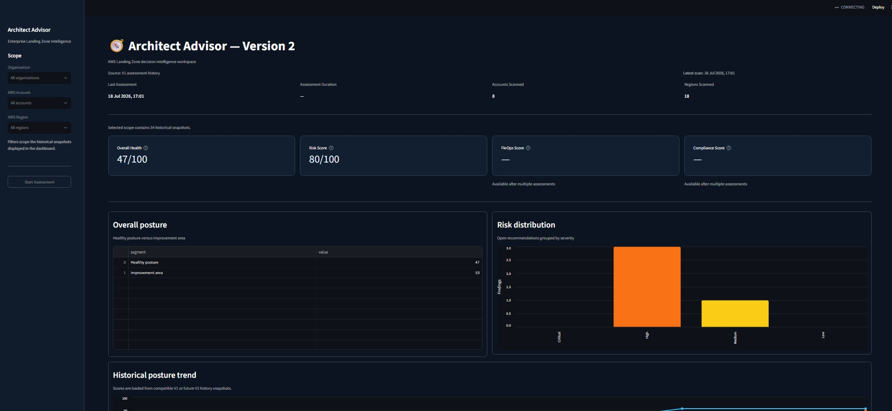
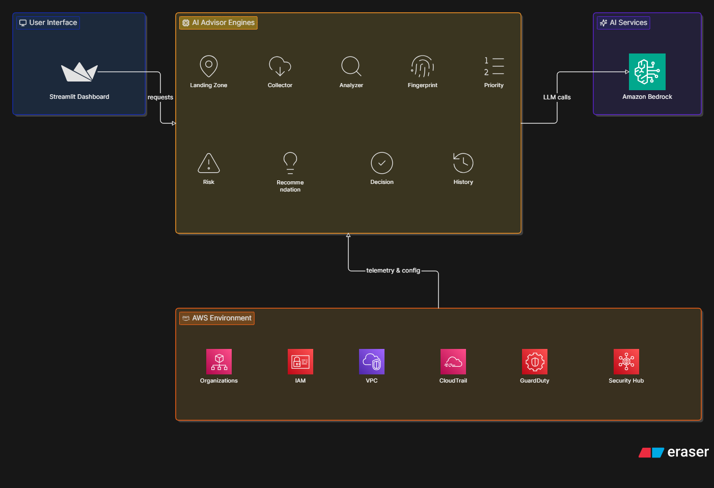

# AI Architect Advisor (AIA)

> An open-source AI-powered Decision Intelligence Platform for AWS Landing Zones.

AI Architect Advisor turns AWS assessment data and security findings into
architectural intelligence: posture trends, explainable risks, correlated attack
paths, prioritized actions, and executive narratives.

## Current release: V2.0

V2 is the primary Streamlit experience. It keeps the original V1 AWS assessment
pipeline as its data-collection engine and adds a modular application layer for
new decision-intelligence capabilities.

Current capabilities include:

- AWS Organizations, IAM, CloudTrail, GuardDuty, and Security Hub assessment
- Risk scoring, prioritization, recommendations, and executive reports
- Historical snapshots with organization, account, and region filters
- Landing Zone Timeline and architectural fingerprint comparison
- Risk and posture forecasting based on historical assessments
- Local evidence-based storytelling and optional Amazon Bedrock generation
- Security Findings dossier with correlation, attack path, evidence locker,
  explainable risk, timeline, and narrative
- Importer contracts for Security Hub, Inspector, Nessus, Nmap, and OpenVAS

The Security Findings UI currently uses an isolated deterministic demo dossier.
Importer interfaces are present, while live ingestion from the declared sources is
planned work.

## Dashboard



Additional views:

- [Forecast](docs/images/dashboard-forecast.jpeg)
- [Landing Zone Timeline](docs/images/landing-zone-timeline.jpeg)
- [AI Storytelling](docs/images/ai-storytelling.jpeg)
- [Security Findings](docs/images/security-findings.jpeg)

## Architecture



```text
AWS Landing Zone
       |
       v
V1 collectors and analyzers
       |
       v
Risk / Priority / Recommendation / History engines
       |
       v
DashboardService application boundary
       |
       +--> Timeline / Fingerprint / Forecast / AI Storytelling
       +--> Security Findings module
       |
       v
Streamlit V2 dashboard
```

The dashboard accesses assessment data through `DashboardService`; V2 modules do
not directly depend on Streamlit or construct AWS clients. Security dossiers are
stored separately from the V1 assessment history.

## Requirements

- Python 3.11 or newer
- AWS credentials only when running a real assessment or Amazon Bedrock narrative

## Installation

```bash
git clone https://github.com/michele-cloud-cyber/architect-intelligence-advisor.git
cd architect-intelligence-advisor

python -m venv .venv
```

Activate the environment:

```bash
# Linux/macOS
source .venv/bin/activate

# Windows PowerShell
.venv\Scripts\Activate.ps1
```

Install the runtime dependencies:

```bash
python -m pip install -r requirements.txt
```

For development and tests:

```bash
python -m pip install -r requirements-dev.txt
```

## Run

Start the V2 dashboard from the repository root:

```bash
streamlit run app.py
```

The dashboard loads the compatible snapshots already stored in `history/` and
`sr/history/`. The **Run assessment** action uses the V1 AWS pipeline and therefore
requires valid AWS credentials and permissions.

## Tests

```bash
python -m pytest -q
```

The test suite covers Security Findings case IDs, importers, deterministic
correlation and risk scoring, evidence integrity, persistence isolation, service
integration, and Streamlit rendering.

## Project structure

```text
app.py                  # V2 application entry point
dashboard_v2/           # Streamlit presentation and dashboard adapters
sr/                     # V1 collectors, engines, services, and history
v2/modules/             # Independent V2 capability modules
tests/                  # Automated test suite
docs/                   # Architecture and dashboard images
history/                # Compatible assessment snapshots
```

## Module status

| Module | Status |
| --- | --- |
| Landing Zone Timeline | Available |
| Fingerprint Engine | Available |
| Forecast Engine | Available |
| AI Storytelling | Available; Bedrock is optional |
| Security Findings | Demo MVP available; live ingestion planned |
| FinOps Dashboard | Planned |
| Recommendation Engine V2 | Planned |
| What-if Simulator | Planned |

## Roadmap

- Connect Security Findings importers to live sources
- Add FinOps metrics and cost optimization views
- Implement remediation what-if simulation
- Add V2 recommendation and compliance modules
- Expand multi-account analysis and architecture pattern recognition

## License

MIT License. Pull requests, suggestions, and architectural discussions are welcome.
