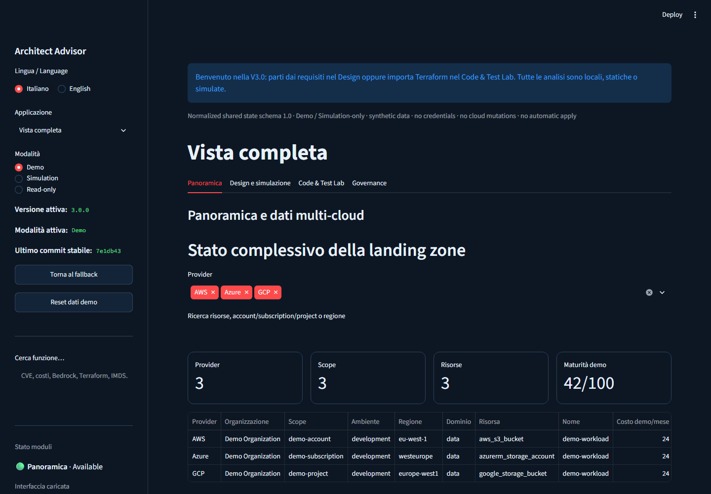
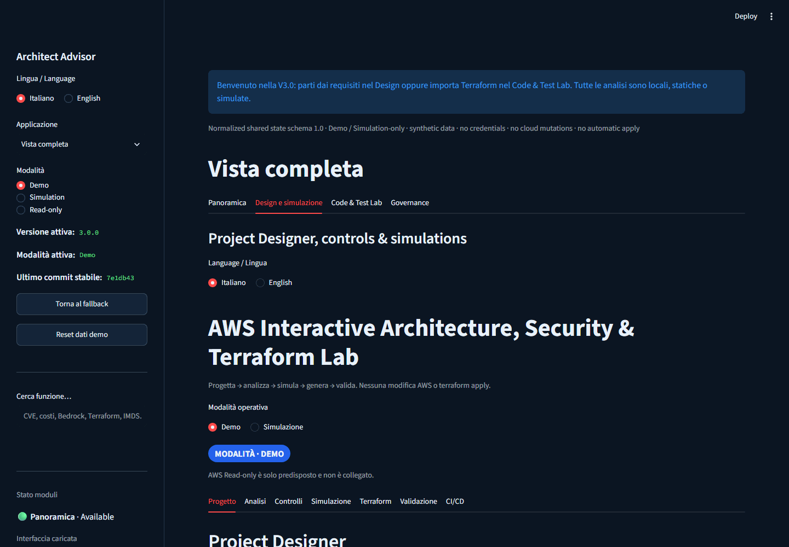
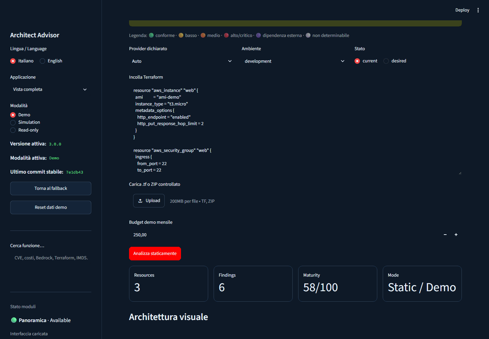
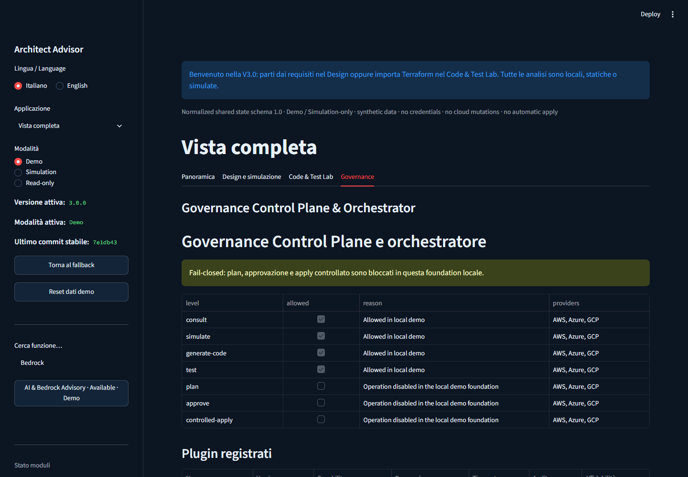
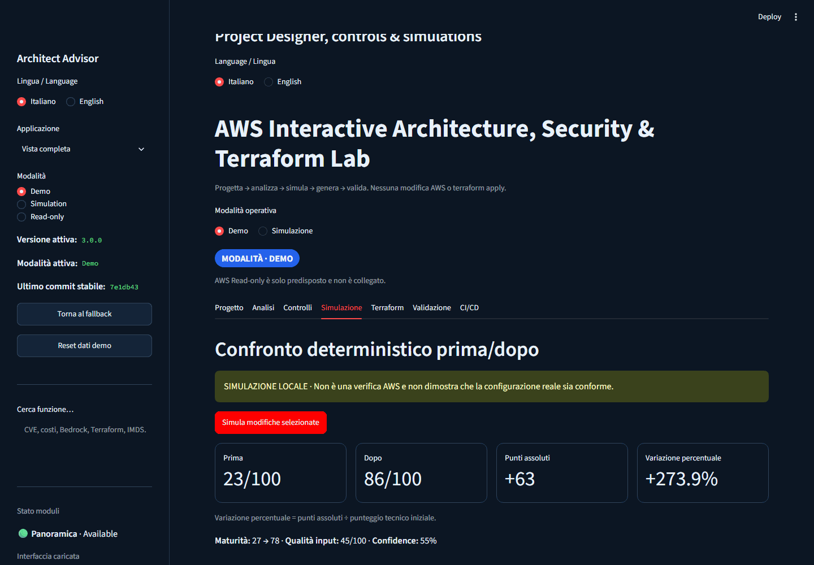
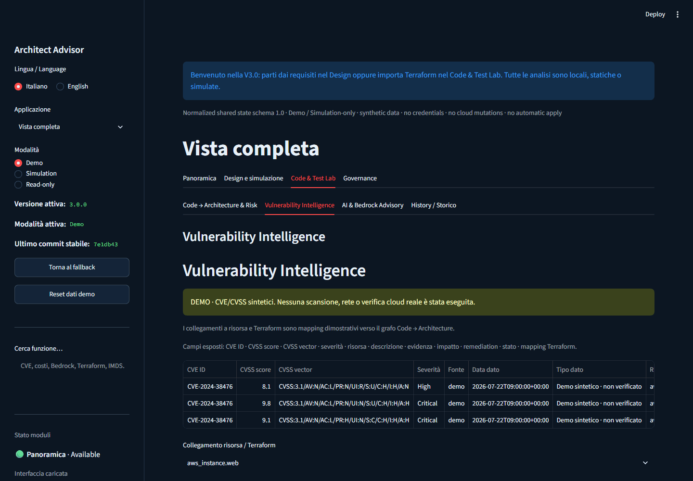
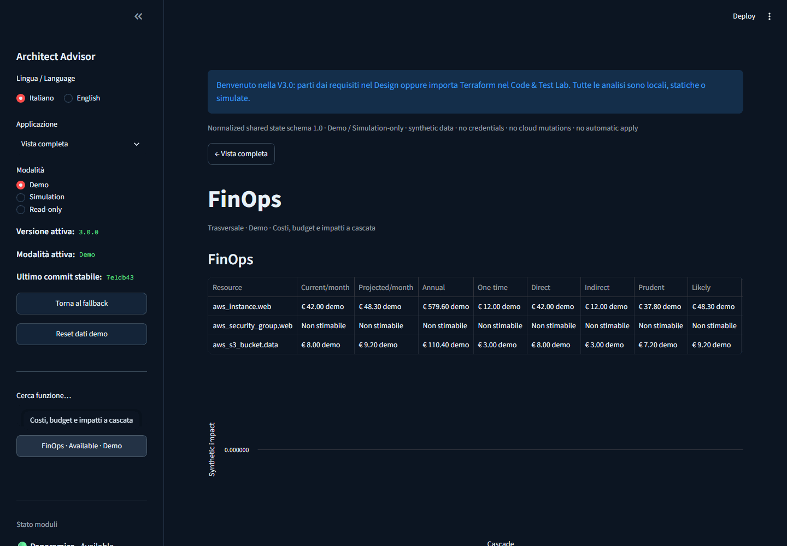
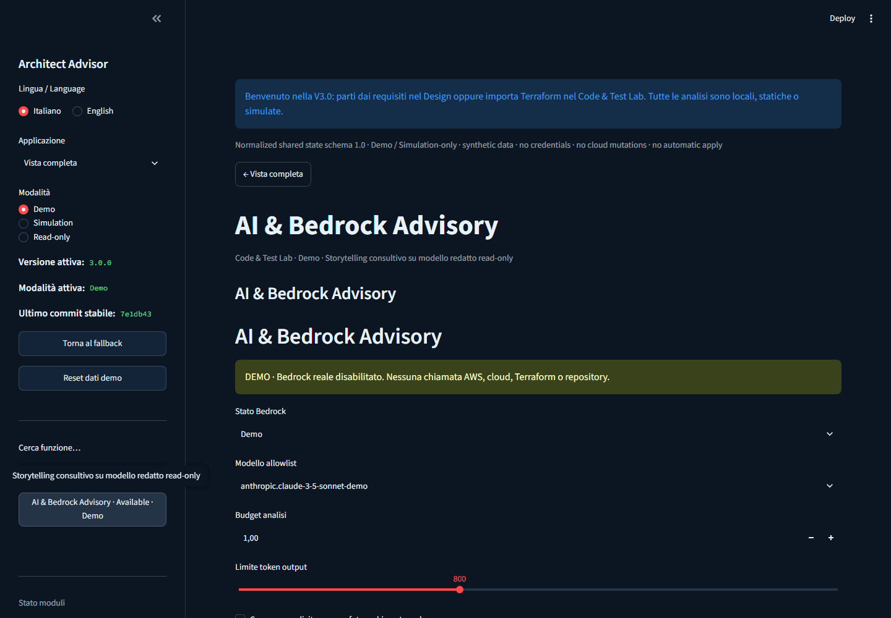
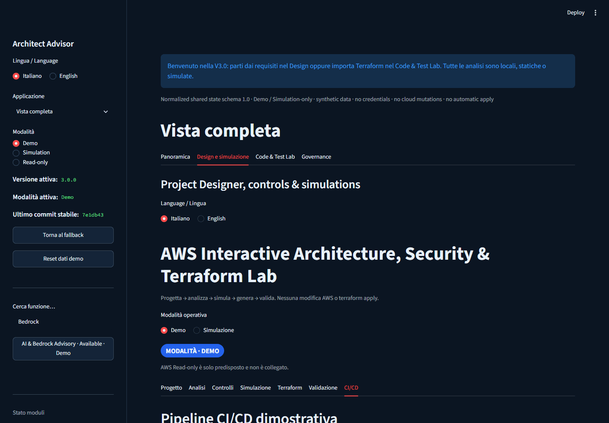
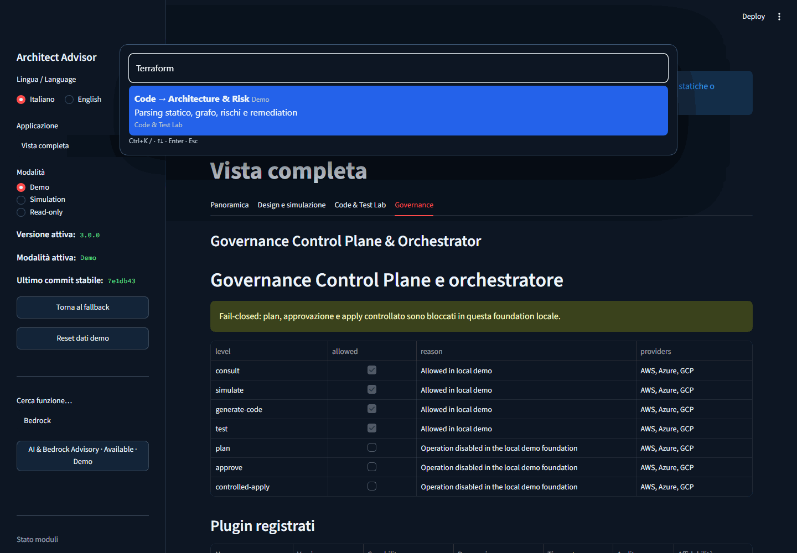

# Adaptive Multi-Cloud Architect Advisor 3.0.0



> [!IMPORTANT]
> **Demo / Simulation / Read-only** — synthetic data only. No credentials,
> cloud mutations, provider execution, Terraform plan/apply or network calls.

Portfolio-grade local advisory and digital-twin laboratory for cloud engineers.
It transforms requirements into architecture and Terraform, and statically turns
Terraform back into architecture, risks, FinOps scenarios and remediations.

## Problem solved

Cloud architecture decisions are frequently split across diagrams, tickets,
Terraform, security scanners and cost spreadsheets. This project provides one
traceable workspace where a decision can be followed from requirement to control,
simulation, Terraform property, policy, test, cost and history—without touching a
real environment.

## Two complementary flows

```text
Requirements → Architecture → Simulation → Terraform → Tests → CI/CD
Terraform → Visual Architecture → Risks → FinOps → Remediation → Simulation → Diff
```

## Four areas

1. **Overview** — synthetic AWS, Azure and GCP inventory, filtering and maturity.
2. **Design & Simulation** — bilingual Project Designer, granular controls,
   deterministic before/after comparison and residual risk.
3. **Code & Test Lab** — controlled `.tf`/ZIP input, static architecture graph,
   findings, IMDSv2 reasoning, FinOps, proposed diff, validation and CI/CD examples.
4. **Governance** — fail-closed control plane, orchestrator, plugin allowlist,
   audit-oriented status, module health and fallback.

History, FinOps and governance are cross-cutting capabilities.

| Overview | Design & Simulation |
| --- | --- |
| [](docs/images/01-overview-multicloud.png) | [](docs/images/02-design-simulation.png) |
| **Code & Test Lab** | **Governance** |
| [](docs/images/04-code-to-architecture-risk.png) | [](docs/images/09-governance-orchestrator.png) |

## Product tour

All screens below use synthetic Demo data and local deterministic analysis.

### Multi-cloud overview

AWS, Azure and GCP demo inventory share one normalized, provider-neutral view.


### Project Designer

Requirements, constraints and target services are captured before analysis.


### Before/after analysis

Absolute points, percentage change, residual risk and confidence remain distinct.



### Code → Architecture & Risk

Controlled Terraform input becomes a static architecture and granular risk model.


### CVE/CVSS intelligence

Synthetic, explicitly unverified vulnerability records map back to resources and code.



### FinOps

Demo cost ranges and cross-resource impacts are separated from provider quotes.



### AI & Bedrock Advisory

Deterministic local advisory exposes model allowlisting and budget controls while
real Bedrock invocation remains disabled.



### Terraform and CI/CD

The delivery example keeps pull requests apply-free and controlled apply inert by default.



### Governance and orchestrator

The fail-closed control plane keeps plan, approval and apply unavailable locally.


### Global command palette

Search navigates the central module registry without executing cloud or AI actions.



## AI & Bedrock Advisory and global search

The visible AI advisory module interprets only a normalized, redacted, read-only
local model. In Demo it deterministically estimates input/output tokens, per-analysis
cost and remaining budget, then presents narrative, risks, dependencies, historical
evolution, architecture suggestions and current/proposed comparison. Real Bedrock is
disabled by default and no invocation client exists in V3. A future connection would
require explicit consent, a temporary least-privilege role, allowlisted model, token
and cost limits, timeout, redaction and fail-closed prompt-injection controls.

Navigation and search share one central provider-neutral module registry. Use the
permanent **Cerca funzione… / Search function…** field or press **Ctrl+K**. Press `/`
outside an input to open the palette, use arrow keys, Enter and Esc. Search only
navigates; it never scans, generates code or invokes AI/cloud services. Browser
`Ctrl+F` is not replaced.

## Architecture

```text
Streamlit entry points
  ├─ stable: streamlit_app.py
  ├─ foundation: demo_streamlit_app.py
  └─ complete V3: unified_app.py
          │
          ├─ versioned NormalizedAppState
          ├─ fault-isolated UI module boundaries
          ├─ common Cloud Resource Model
          ├─ AWS / Azure / GCP demo adapters
          ├─ Input Security Gateway
          ├─ static Terraform parser + findings
          ├─ remediation simulator + diff
          ├─ synthetic FinOps adapters
          └─ Governance Control Plane + Orchestrator
```

Provider adapters never call one another. The UI and orchestrator use common
contracts. A failed optional module is marked `Degraded` or `Unavailable`; the
stable laboratory and fallback remain usable.

## Static Terraform security model

The Input Security Gateway is fail-closed and permits only bounded `.tf` text:

- controlled extensions, file count, member size and expanded ZIP size;
- path traversal, absolute paths, symlinks and suspicious compression blocked;
- malformed/non-text files rejected;
- `local-exec`, `remote-exec`, file provisioners, filesystem reads, HTTP/external
  data sources and remote module downloads blocked;
- secret-like literals redacted before analysis;
- no Terraform CLI, shell execution, provider loading, network or external storage.

Original input is never modified. Remediation produces a separate review-only ZIP.
Vulnerability Intelligence labels CVE/CVSS rows with source, observation date and
data class (`Demo sintetico · non verificato`); it never implies a real scan.

## Analysis coverage

The current deterministic static rules cover public CIDRs, wildcard IAM, secrets,
encryption, tags and IMDSv2. IMDSv2 recommends `http_tokens = "required"`; hop
limit `2` is retained as a valid compatibility option when containers require it.
The common finding model also supports logging, monitoring, backup, versioning,
retention, resilience, orphan resources and costs for progressive rule additions.

FinOps values are explicitly synthetic ranges—not provider quotes. Unknown resource
types display `Non stimabile`. Direct cloud cost and operational compatibility cost
remain separate.

## Windows

Requires Windows 10/11 and Python 3.11+.

- `start_complete_app.bat` — complete V3 application.
- `start_app.bat` — preserved stable version.
- `start_foundation_app.bat` — preserved multi-cloud foundation.

Each launcher creates `.venv` when needed and installs `requirements.txt`.

## Development

```powershell
python -m venv .venv
.venv\Scripts\python.exe -m pip install -r requirements.txt
.venv\Scripts\python.exe -m pytest -q
.venv\Scripts\python.exe -m streamlit run unified_app.py
```

## Limitations and future read-only roadmap

- Terraform parsing is intentionally conservative, not a full HCL evaluator.
- No interpolation evaluation, module resolution or provider schema lookup.
- Architecture layout and prices are synthetic advisory aids.
- No real AWS, Azure or GCP connection in V3.
- Future work: user-authorized read-only inventory adapters, signed evidence import,
  broader rule packs and independently sandboxed security/FinOps integrations.
- Controlled apply is outside this portfolio release.

## License proposal

The repository license has **not been changed**. For a public portfolio, consider
Apache License 2.0 (explicit patent grant) or MIT (short and permissive). Confirm
the preferred license before replacing the existing file.

See [CHANGELOG.md](CHANGELOG.md) and [docs/PUBLISHING_CHECKLIST.md](docs/PUBLISHING_CHECKLIST.md).
